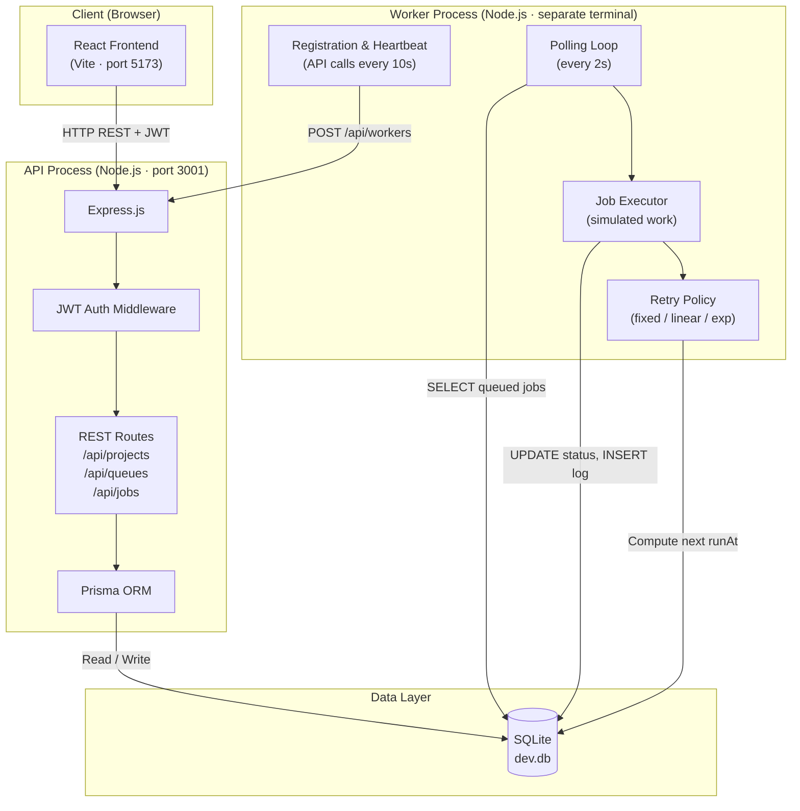

# Architecture

## System Overview

The Distributed Job Scheduler is composed of three independent processes communicating exclusively through a shared SQLite database. This is the "distributed" aspect of the system — two separate processes (API and Worker) never call each other's functions; they only read from and write to the same database file.

## Why API and Worker Are Separate Processes

### The Core Design Principle

The API server handles HTTP requests from users and writes jobs to the database. The Worker is a completely separate Node.js process that polls the database for work to do. They communicate **only through the database** — no shared memory, no function calls, no inter-process communication sockets.

This is the fundamental pattern behind systems like:
- **YouTube**: Upload API writes a "transcode video" job; a separate fleet of worker machines polls for transcoding jobs
- **Gmail**: Sending API creates "deliver email" jobs; a separate SMTP worker fleet processes them asynchronously
- **Uber**: Receipt API creates "generate receipt" jobs; a separate PDF generation service processes them

### Advantages of This Architecture

1. **Failure isolation**: If the Worker crashes, the API keeps accepting jobs. When the Worker restarts, it picks up where it left off. No work is lost.
2. **Independent scaling**: You could run 10 API servers and 50 Worker instances (with distributed locking) without changing either service's code.
3. **Auditability**: Every job state transition is written to the `Execution` table, giving you a complete audit trail. A push-based queue (like Redis/BullMQ) would lose this history if not explicitly configured.
4. **Simplicity for local dev**: One SQLite file, two `node` processes. No Redis, no Kafka, no cloud setup.

### Tradeoffs vs. a Production Push-Based System

A polling worker has a latency floor equal to the poll interval (2 seconds here). A production system (e.g., BullMQ with Redis pub/sub) can dispatch jobs in milliseconds using push semantics. See `DESIGN_DECISIONS.md` for a detailed comparison.

## Request Flow

1. **User submits a job** → Frontend calls `POST /api/jobs`
2. **API validates + writes** → Express route handler validates JWT and payload, Prisma writes the Job row with `status=queued`
3. **Worker detects it** → On the next poll cycle (≤2s), the Worker's SELECT query finds the new job
4. **Worker executes** → Transitions job through `claimed → running → completed/failed`
5. **User sees result** → Frontend polls or refreshes; reads the updated status from the API

## Component Descriptions

| Component | Technology | Responsibility |
|---|---|---|
| Frontend | React + Vite + Tailwind | User interface, job submission, status visualization |
| API | Express.js + Prisma | REST endpoints, auth, data validation, DB writes |
| Worker | Plain Node.js | Job polling, execution simulation, retry logic |
| Database | SQLite via Prisma | Shared state — the "message bus" between API and Worker |
