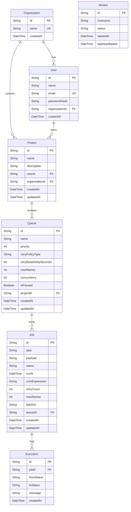

# Entity Relationship Diagram

## ER Diagram (Mermaid)



## Relationship Explanations

### Organization → User / Project (one-to-many)
Organizations act as the highest-level grouping for enterprise deployments. Users belong to an organization, and projects are contained within an organization.
**Why**: Allows for enterprise multi-tenancy and team collaboration in future features.

### Worker 
Standalone entity tracking active background job processors.
**Why**: Enables live monitoring of the worker pool on the dashboard via heartbeat timestamps.

### User → Project (one-to-many)
Each `User` can own many `Project` records. Every `Project` has a `userId` foreign key pointing to `User.id`. When a user is deleted (onDelete: Cascade), all their projects are deleted, which cascades through queues and jobs.

**Why**: Multi-tenant data isolation. All API queries filter by `userId` so users can never see each other's data.

### Project → Queue (one-to-many)
Each `Project` can contain many `Queue` records. Queues belong to exactly one project via `projectId` FK. Deleting a project cascade-deletes all its queues (and their jobs).

**Why**: Projects are organizational containers (e.g., "Email Service", "Video Pipeline"). Within a project, different queues can have different priorities, retry policies, and concurrency settings.

### Queue → Job (one-to-many)
Each `Queue` holds many `Job` records. Jobs inherit retry policy configuration from their queue (`retryPolicyType`, `retryBaseDelaySeconds`, `maxRetries`) unless explicitly overridden. Deleting a queue cascade-deletes all its jobs and their execution logs.

**Why**: Queues are the scheduling unit. The worker groups jobs by queue to enforce concurrency limits and priority ordering.

### Job → Execution (one-to-many)
Each `Job` accumulates `Execution` log rows over its lifetime — one per status transition. This is the audit trail of the job's state machine journey. Deleting a job cascade-deletes its log.

**Why**: Full observability. You can reconstruct the exact history of any job: when it was created, claimed, how many times it failed, what error messages were recorded, and when it finally completed or went to dead_letter.

## Index Explanations

### `@@index([status, runAt])` on Job
**The most important index.** The Worker's primary query is:
```sql
SELECT * FROM Job WHERE status = 'queued' AND runAt <= ? AND queue.isPaused = false
```
The composite index on `[status, runAt]` means SQLite can seek directly to `status='queued'` rows and then apply the `runAt` range filter efficiently. Without this index, every poll cycle would do a full table scan of all jobs.

**Cardinality note**: `status` is low-cardinality (7 values) but `runAt` is high-cardinality, so the composite is much more selective than `status` alone.

### `@@index([queueId])` on Job
Used when listing jobs by queue (the queue detail page) and when the worker groups jobs by queue for concurrency tracking.

### `@@index([batchId])` on Job
Used to retrieve all jobs in a batch together. Low frequency but needed for the batch grouping feature.

### `@@index([userId])` on Project
Used on every project listing query (`GET /api/projects`). Without this, finding a user's projects would scan all projects.

### `@@index([projectId])` on Queue
Used when loading a project's queues (`GET /api/queues?projectId=...`). Also used in the ownership verification join: `Queue WHERE projectId IN (SELECT id FROM Project WHERE userId = ?)`.

### `@@index([jobId])` on Execution
Used when loading a job's execution logs (`GET /api/jobs/:id/logs`). Each job can have many log entries, so this is queried frequently on the job detail page.

### `email @unique` on User
Enforces unique emails at the database level (not just application level), preventing duplicate registrations even under concurrent requests.
